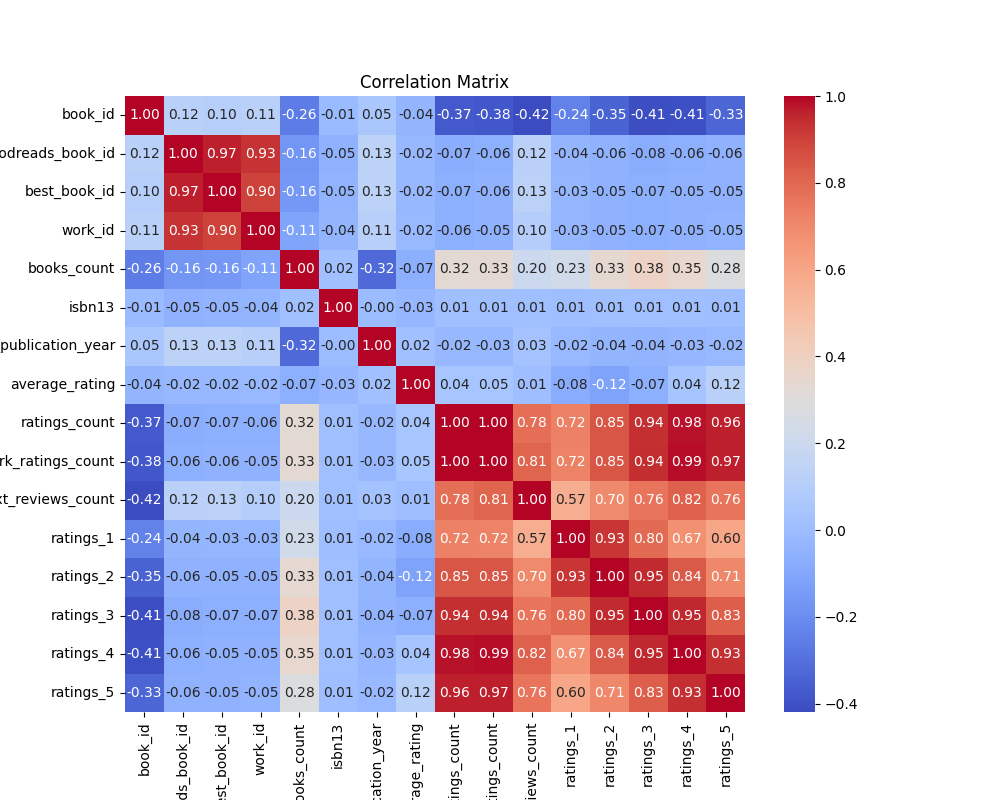
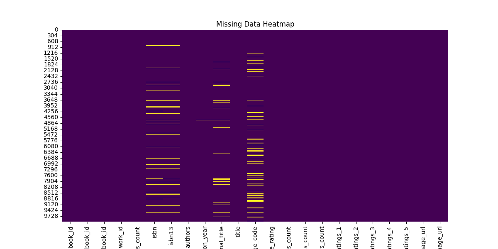
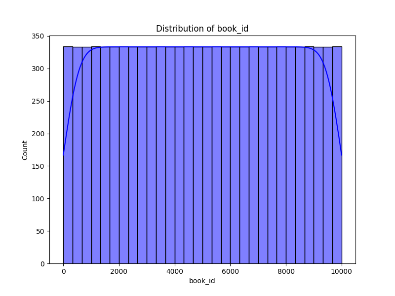

# Automated Data Analysis
## Dataset Summary
- Shape: (10000, 23)
### Column Information:
book_id                        int64
goodreads_book_id              int64
best_book_id                   int64
work_id                        int64
books_count                    int64
isbn                          object
isbn13                       float64
authors                       object
original_publication_year    float64
original_title                object
title                         object
language_code                 object
average_rating               float64
ratings_count                  int64
work_ratings_count             int64
work_text_reviews_count        int64
ratings_1                      int64
ratings_2                      int64
ratings_3                      int64
ratings_4                      int64
ratings_5                      int64
image_url                     object
small_image_url               object

### Missing Data:
book_id                         0
goodreads_book_id               0
best_book_id                    0
work_id                         0
books_count                     0
isbn                          700
isbn13                        585
authors                         0
original_publication_year      21
original_title                585
title                           0
language_code                1084
average_rating                  0
ratings_count                   0
work_ratings_count              0
work_text_reviews_count         0
ratings_1                       0
ratings_2                       0
ratings_3                       0
ratings_4                       0
ratings_5                       0
image_url                       0
small_image_url                 0

## Narrative Analysis
### Data Analysis and Insights

#### Overview
The dataset of 10,000 rows and 23 columns provides a comprehensive insight into a collection of books, likely sourced from a platform like Goodreads. The columns cover various attributes—from basic identifiers (like `book_id` and `goodreads_book_id`) to reader engagement metrics (like `average_rating` and `ratings_count`). However, the presence of 2,975 missing values across the dataset indicates that some attributes may be under-reported or not applicable to all books.

#### Insights and Possible Narratives

1. **Book Popularity and Engagement:**
   - The columns `average_rating`, `ratings_count`, and `work_ratings_count` allow us to gauge the popularity of books. 
   - A potential analysis could compare `average_rating` against `ratings_count` to identify if higher-rated books also have a greater number of ratings. For example, a book with an average rating of 4.5 from 100 ratings might be more meaningful than one rated the same from only 10 ratings. This could lead to insights about the impact of community engagement on perceived quality.

2. **Year of Publication Trends:**
   - The `original_publication_year` is integral to understanding trends in reading preferences over time. An analysis could reveal if certain years produced more critically acclaimed books, or if there is a growing trend in self-published authors as time progresses.
   - By plotting the distribution of publications over the years with their average ratings could illustrate how reading trends have shifted in recent decades.

3. **Author Influence:**
   - The `authors` column can serve as a focal point for exploring author popularity and its correlation with book ratings. By aggregating ratings based on authors, we could identify rising stars or long-established favorites. 
   - Additionally, an exploration of the most prolific authors (those with the highest `books_count`) can shed light on the relationship between quantity and quality in publishing.

4. **Ratings Distribution:**
   - The individual rating counts (from `ratings_1` to `ratings_5`) can paint a clearer picture of reader sentiment. By analyzing the distribution of ratings, we could identify trends such as:
     - The presence of polarizing books (with a significant number of 1-star and 5-star ratings).
     - Books that consistently receive lower ratings compared to peers in the same genre or period.

5. **Language and Regional Reading Trends:**
   - The `language_code` column can be used to analyze the diversity of languages represented in popular literature. It would be intriguing to assess if there are language-specific trends in ratings, or if English-language books dominate the high-average ratings.
   - This analysis could extend into cultural insights—what themes resonate in books written in different languages?

6. **Impact of Visuals:**
   - The `image_url` and `small_image_url` could provide insights into how cover design plays a role in attracting readers. We could analyze if books with high average ratings often have professional cover designs which may correlate with better market performance.

### Narrative: "The Tale of Two Readers"

Imagine two readers: Alex and Jamie. 

Alex is fascinated by the stories told over decades. He loves exploring historical fiction and often navigates through older publications. Each month, he finds himself diving into books published in the 1970s and 1980s that have an average rating above 4.0. He wonders—are these stories timeless shadows of a past era that resonate with others as they do with him? 

On the other hand, Jamie thrives in the world of modern literature. She revels in bestsellers topped by their gorgeous covers and vibrant testimonials. A glance at the dataset reveals that the most popular current authors are achieving astounding ratings despite being newcomers to the scene. 

As the two converse, they share findings through the dataset. They discover that while both have different tastes, the best-rated books often come from authors who, despite their diverse backgrounds, share the ability to weave intricate narratives filled with universal themes of love, loss, and triumph. 

Their discussion sparks a journey through genres and times, revealing hidden gems in the dataset such as an underrated work published in the 1980s that possesses a deep heart and soul, or a new novel that brilliantly captures the zeitgeist of today. 

Through Alex and Jamie's exploration, they view the dataset not just as numbers and columns but as a reflection of a vast, vibrant world of reading that weaves together countless lives, stories, and insights, reminding them of the power literature holds to bridge differences and connect humanity. 

### Conclusion

In conclusion, the dataset serves not only as a collection of numbers but a portal into the diverse world of literature. With trends, insights, and stories inherent in the data, an analysis could lead to greater appreciation and understanding of the literary landscape, potentially influencing future readings, book selections, or even publishing endeavors.

## Visualizations

