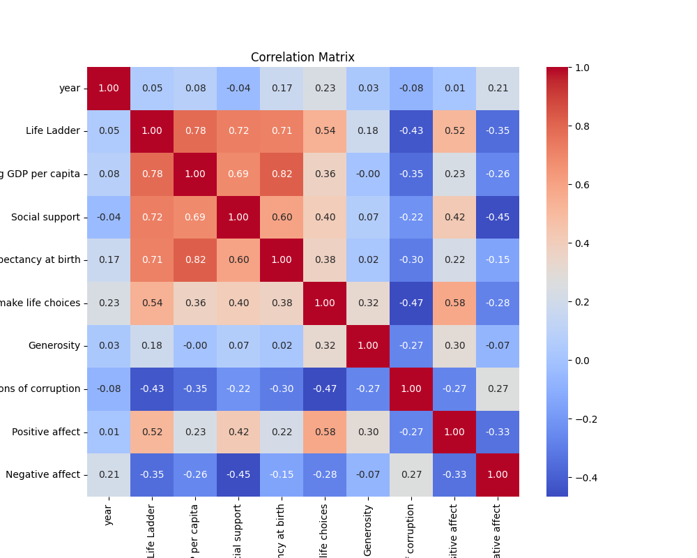
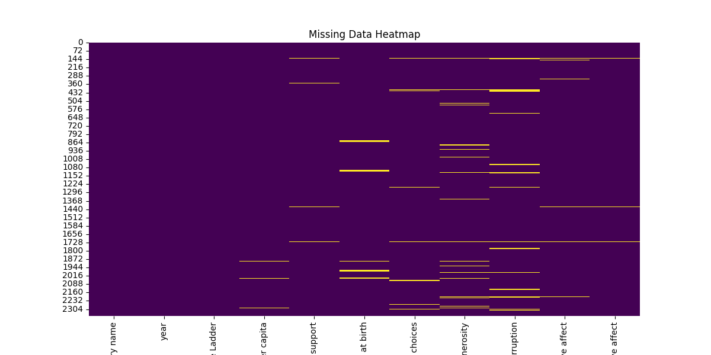
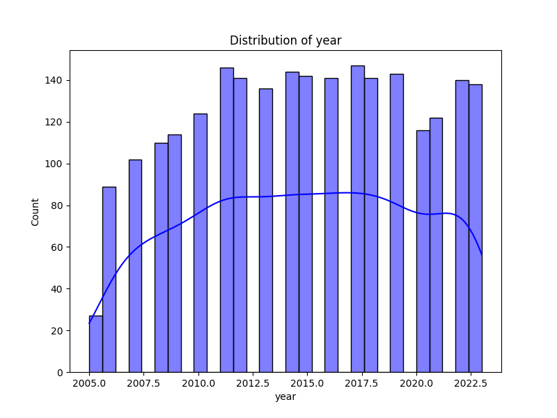

# Automated Data Analysis
## Dataset Summary
- Shape: (2363, 11)
### Column Information:
Country name                         object
year                                  int64
Life Ladder                         float64
Log GDP per capita                  float64
Social support                      float64
Healthy life expectancy at birth    float64
Freedom to make life choices        float64
Generosity                          float64
Perceptions of corruption           float64
Positive affect                     float64
Negative affect                     float64

### Missing Data:
Country name                          0
year                                  0
Life Ladder                           0
Log GDP per capita                   28
Social support                       13
Healthy life expectancy at birth     63
Freedom to make life choices         36
Generosity                           81
Perceptions of corruption           125
Positive affect                      24
Negative affect                      16

## Narrative Analysis
The dataset you're working with appears to be related to various aspects of well-being in different countries, as indicated by the columns present. Here’s a structured analysis, followed by a narrative that draws insights from the data.

### Data Analysis:

1. **Understanding Key Metrics**:
   - **Life Ladder**: A measure of subjective well-being or happiness.
   - **Log GDP per capita**: Represents the economic prosperity of a country.
   - **Social Support**: Reflects the perceived level of support individuals feel they have from family and friends.
   - **Healthy Life Expectancy at Birth**: Indicates the overall health of the population and the effectiveness of healthcare systems.
   - **Freedom to Make Life Choices**: Captures the extent to which people feel they can make their own decisions.
   - **Generosity & Perceptions of Corruption**: Factors contributing to social trust and engagement in a society.
   - **Positive & Negative Affect**: These represent emotional states and can influence overall well-being.

2. **Missing Values**:
   - The dataset contains 386 missing values, which accounts for about 16.3% of the total dataset. Before further analysis, it’s essential to determine the implications of these missing values and whether to impute them, exclude them, or perform analyses separately.

3. **Correlation Analysis**:
   - **Life Ladder and Log GDP per Capita**: We might expect a positive correlation, suggesting that countries with higher GDP per capita tend to report higher levels of happiness.
   - **Life Ladder and Social Support**: Also likely to show a positive correlation, indicating that social connections enhance subjective well-being.
   - **Negative Affect and Life Ladder**: Expected to show a negative relationship, implying that higher levels of negative emotions correlate with lower happiness levels.

4. **Comparative Analysis**:
   - Analyze the average Life Ladder score across different regions or income categories (low, middle, high).
   - Compare the influence of GDP, Social Support, and Freedom on the Life Ladder across various countries with distinct socio-economic backgrounds.

5. **Outlier Detection**:
   - Identify countries that rank unusually high or low in Life Ladder relative to their GDP per capita or Social Support. Understanding these outliers can provide insights into unique national circumstances or cultural factors affecting happiness.

### Insights and Narrative:

#### The Story of Happiness Across Borders

Imagine a world where happiness is a tangible metric—a measure that transcends geographical boundaries, a reflection of economic prosperity, social connections, and personal freedom. This dataset captures that essence, telling the story of how countries fare in the monumental pursuit of happiness.

In the bustling streets of modern nations, we observe that the wealthier a country, the more likely its citizens report a higher Life Ladder score. The data reveals a pattern: as GDP per capita rises, so too do feelings of well-being. Yet, the plot thickens. Social support emerges as a powerful factor—countries where people feel backed by families and communities tend to foster happiness regardless of economic standing.

Imagine two countries: Country A, rich in resources but low on social bonds, and Country B, not as affluent but filled with laughter and camaraderie. The happiness score of Country B defies economic logic, reminding us that wealth isn't everything. The Freedom to make choices expands this narrative, showcasing that personal agency can outweigh material wealth.

As we dive deeper, the dark underbelly of this pursuit reveals itself through perceptions of corruption. Countries stricken by corruption dampen the spirits of their people, reflecting in lower scores on the Life Ladder. The emotional tapestry woven through Positive and Negative Affect illustrates how collective experiences—joy and sorrow—shape national outlooks on life.

As we sift through the numbers, some outliers capture our attention. Consider nations where happiness thrives against all odds, painting a picture of resilience and cultural fortitude. OR equally compelling, nations that struggle despite ample resources, prompting questions about how societal norms and governance affect individual well-being.

In conclusion, this data does not merely catalog numbers; it reveals the intricate web of life that binds humanity, where economic power, social networks, personal freedom, and the fight against corruption converge to create a rich narrative on happiness. The journey to uncover the hidden stories behind these statistics is as enlightening as the insights themselves—reminding us that while the indicators of progress are vital, the qualitative essence of happiness is a profoundly human experience. 

This dataset is not merely an academic exercise; it is a call to leaders and citizens alike to foster environments where happiness can flourish, irrespective of borders or economic conditions.

## Visualizations

