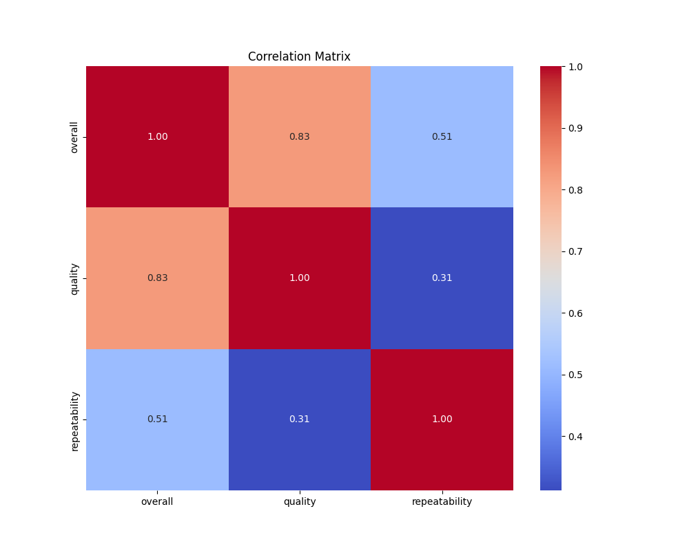
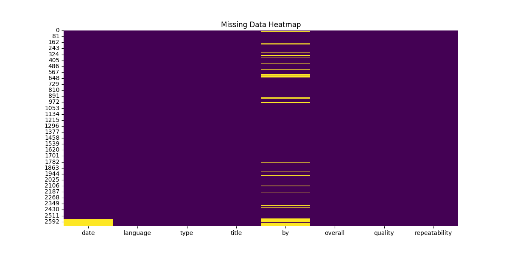
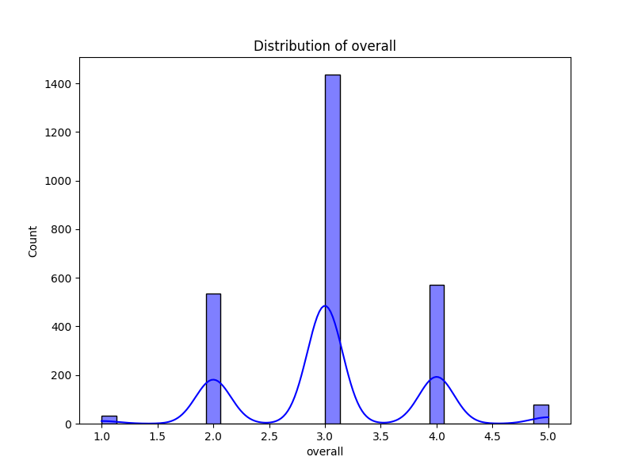

# Automated Data Analysis
## Dataset Summary
- Shape: (2652, 8)
### Column Information:
date             object
language         object
type             object
title            object
by               object
overall           int64
quality           int64
repeatability     int64

### Missing Data:
date              99
language           0
type               0
title              0
by               262
overall            0
quality            0
repeatability      0

## Narrative Analysis
To analyze the dataset with 2652 rows and 8 columns, we'll examine the implications and patterns within the data based on the available columns: date, language, type, title, by, overall, quality, and repeatability. Here’s a structured approach to derive insights and narrate a story:

### Overview of the Dataset
1. **Shape and Structure**: The dataset consists of 2652 entries and 8 features, indicating a substantial sample from which to derive trends and insights.
   
2. **Missing Values**: With 361 missing values across the dataset, it's important to determine which columns are affected and how this may influence any analysis. The proportion of missing values is approximately 13.6%, which is significant enough to warrant attention.

### Key Columns Analysis
1. **Date Analysis**:
   - Analyze how the number of entries varies over time. Are there particular peaks or troughs in data collection? 
   - Check if specific months, quarters, or years show more activity—indicative of trends, seasonal behaviors, or external influences affecting the subjects recorded.

2. **Language**:
   - Assess the variety of languages present. Are certain languages more represented than others? This can highlight cultural or geographical dominance in the dataset.
   - Consider the language distribution and its relationship with overall ratings. For instance, does the language correlate positively or negatively with overall scores, quality, or repeatability?

3. **Type**: 
   - Investigate the different types of entries. Classifying entries into categories can help understand the focus of the dataset (e.g., reviews, articles, blogs).
   - Explore the distribution of ratings in relation to type. Are some types rated consistently higher or lower than others?

4. **Title and Content Analysis**:
   - Analyzing titles may reveal common themes or subjects. Are there keywords that are frequent in well-rated entries?
   - Conduct sentiment analysis on the titles (if they can be classified) or analyze how certain titles correlate with overall ratings.

5. **Author (by)**: 
   - Examine who the authors are and how their contributions vary. Are there a few individuals who dominate the dataset, and do they have higher overall ratings?
   - Map out whether certain authors are linked to specific languages or types.

6. **Overall, Quality, and Repeatability**:
   - Compare overall scores with quality and repeatability metrics. Use correlation analysis to find the strength of relationships between these columns.
   - Classify entries based on their scores. For example, create bins for "low", "medium", and "high" and study the distributions to infer insights, such as whether entries rated as high-scoring share common characteristics.

### Insights Derived
- **Trends Over Time**: Let's say you find a notable increase in entries after a specific time period (e.g., post-pandemic or after a major event). This could indicate the dataset is capturing evolving interests or shifts in informational needs during these periods.
  
- **Language Insights**: If a specific language shows consistently higher quality ratings, this could suggest that content produced in that language is more nuanced, detailed, or catered better to its audience.

- **Type Correlation**: If news articles consistently outperform others in overall scores, it may suggest a higher reader engagement or authoritative trust in those sources.

- **Influential Authors**: Identifying authors with a substantial positive impact on overall scores could lead to a deeper examination of their writing styles or expertise.

### Narration of the Story
Imagine a vibrant tapestry of insights woven from a dataset representing diverse voices and experiences captured through words. As we peel back the layers, we discover fluctuations that reflect the pulsating heart of human interest — a swelling of entries when a global crisis prompts an exploration of shared stories, a burst of creativity emerging in a favored language, and star authors whose compelling narratives captivate and elevate the discourse.

This data offers a glimpse into a dynamic exchange, where the interplay between quality and reader engagement paints a story of continual growth and connection. Behind each missing value is a testament to the evolving nature of storytelling, as authors and audiences alike navigate a landscape rich in possibilities, learning from the past to inspire a future filled with resonant voices. 

Thus, our narrative challenges us to enhance understanding of not only how information is consumed but how it shapes our cultural and collective identities, urging us to appreciate the diversity of stories that bind us all.

## Visualizations

